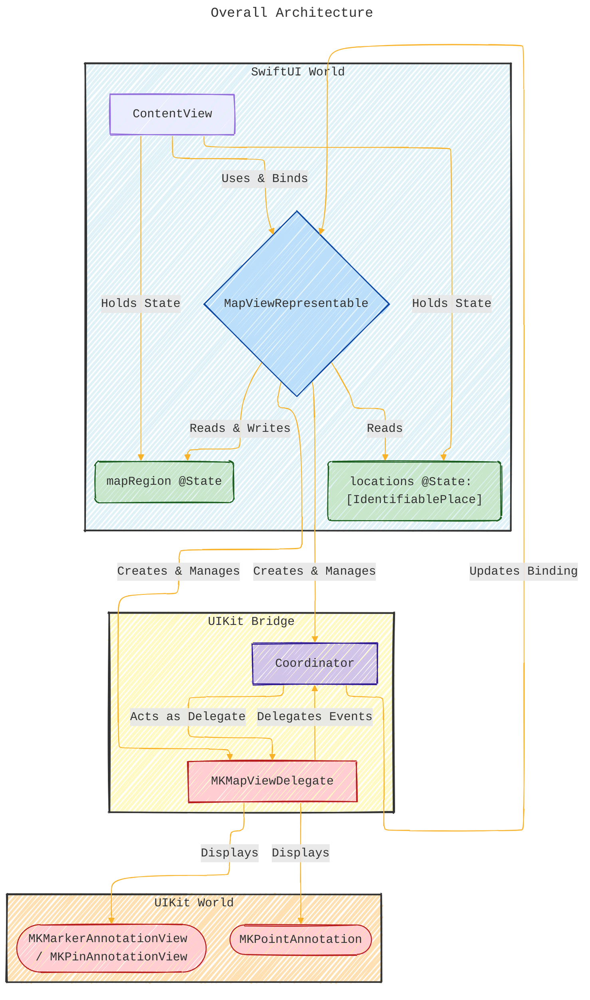
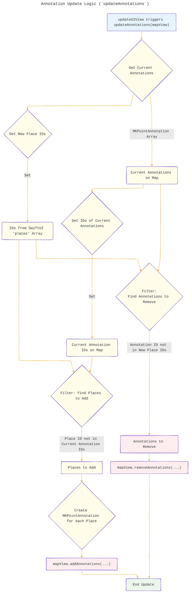
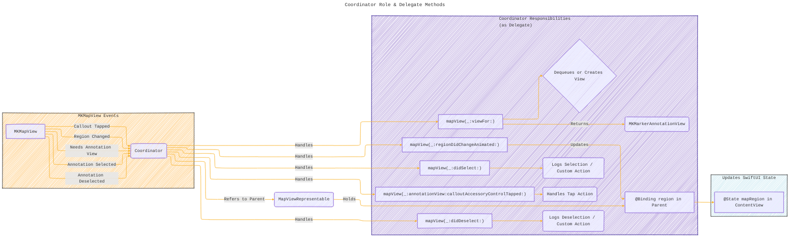
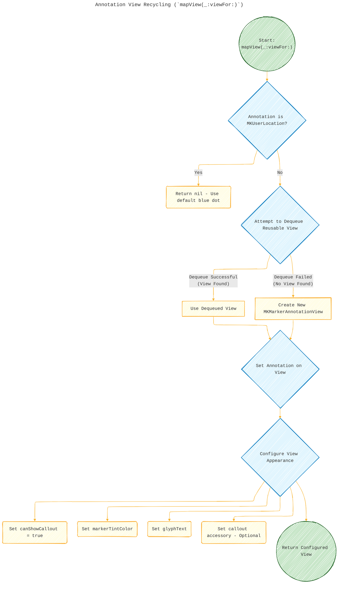

# A Diagrammatic Guide 
> **Disclaimer:**
>
> This document contains my personal notes on the topic,
> compiled from publicly available documentation and various cited sources.
> The materials are intended for educational purposes, personal study, and reference.
> The content is dual-licensed:
> 1. **MIT License:** Applies to all code implementations (Swift, Mermaid, and other programming languages).
> 2. **Creative Commons Attribution 4.0 International License (CC BY 4.0):** Applies to all non-code content, including text, explanations, diagrams, and illustrations.
---

## Overview Concepts 

Let's break down the provided Swift code for integrating MapKit into SwiftUI using `UIViewRepresentable`.

First, a general overview:

This code demonstrates the standard pattern for using UIKit views (like `MKMapView`) within a SwiftUI application. SwiftUI doesn't have a native, fully-featured Map view component (as of the time this pattern is common), so we use `UIViewRepresentable` to wrap the UIKit `MKMapView`. The `Coordinator` pattern is essential for handling delegate callbacks from the `MKMapView` and communicating changes back to the SwiftUI state. The code manages the map's visible region and displays annotations (pins) based on SwiftUI state, allowing for two-way communication between the UI frameworks.

Here are the diagrams illustrating the concepts:

---

## 1. Overall Architecture

This diagram shows the main components and their relationships.

**Explanation:**

*   **SwiftUI World:** Contains the main `ContentView` which holds the application's state (`mapRegion`, `locations`) using `@State`.
*   **UIKit Bridge:** The `MapViewRepresentable` acts as the bridge. It gets data from SwiftUI (`@Binding`, `let places`) and creates/manages the UIKit components (`MKMapView`, `Coordinator`).
*   **UIKit World:** Contains the actual `MKMapView` and its annotations (`MKPointAnnotation`, `MKMarkerAnnotationView`). The `Coordinator` lives here conceptually, receiving delegate callbacks from the `MKMapView`.
*   **Data Flow:** Arrows show how state flows from `ContentView` to the `MapViewRepresentable`, which then configures the `MKMapView`. Events from the `MKMapView` go to the `Coordinator`, which updates the `MapViewRepresentable`'s `@Binding`, flowing back to the `ContentView`'s state.

---

## 2. `UIViewRepresentable` Lifecycle & Interaction

This sequence diagram illustrates the creation and update flow managed by SwiftUI for the `MapViewRepresentable`.

**Explanation:**

1.  SwiftUI initializes `MapViewRepresentable` with the current state and bindings.
2.  SwiftUI calls `makeCoordinator()` on the representable to create the `Coordinator`.
3.  SwiftUI calls `makeUIView()` to create the underlying `MKMapView`. The `Coordinator` is set as the map view's delegate.
4.  SwiftUI calls `updateUIView()` for the initial setup (setting region, adding annotations).
5.  Whenever state bound to the representable changes in SwiftUI (`mapRegion` or `locations`), SwiftUI calls `updateUIView()` again, allowing the representable to synchronize the `MKMapView`.

----

## 3. Data Flow: Two-Way Binding for Region

This diagram highlights how changes to the map's region are synchronized between SwiftUI and UIKit.

**Explanation:**

*   **SwiftUI -> Map:** When `ContentView`'s `@State mapRegion` changes programmatically, `updateUIView` is called. If the change is significant, `MapViewRepresentable` tells the `MKMapView` to `setRegion`.
*   **Map -> SwiftUI:** When the user directly interacts with the `MKMapView`, the map finishes moving and notifies the `Coordinator` via `regionDidChangeAnimated`. The `Coordinator` then updates the `@Binding` (`parent.region`) *asynchronously* on the main queue. This binding change propagates back to `ContentView`'s `@State mapRegion`. The check in `updateUIView` (`regionHasChangedSignificantly`) prevents the `MKMapView` from being immediately reset back by `updateUIView` after the user interaction.

---

## 4. Annotation Update Logic (`updateAnnotations`)

This flowchart shows how annotations are efficiently added or removed when the `places` array in the SwiftUI state changes.

**Explanation:**

1.  Get the annotations currently displayed on the `MKMapView`.
2.  Get the set of unique IDs from the `places` array provided by SwiftUI.
3.  **Removal:** Compare the IDs of current annotations with the new set of IDs. Any annotation whose ID is *not* in the new set is marked for removal.
4.  **Addition:** Compare the new set of IDs with the IDs of the current annotations. Any place whose ID is *not* among the current annotations is marked for addition.
5.  Perform the actual `removeAnnotations` and `addAnnotations` calls on the `MKMapView`.

---

## 5. Coordinator Role & Delegate Methods

This diagram focuses on the `Coordinator`'s function as the delegate.

**Explanation:**

*   The `MKMapView` sends events (like region changes, requests for annotation views) to its delegate, the `Coordinator`.
*   The `Coordinator` implements the corresponding `MKMapViewDelegate` methods.
*   Inside these methods, the `Coordinator`:
    *   Updates the `@Binding` in its parent `MapViewRepresentable` when the region changes.
    *   Provides configured `MKAnnotationView`s (using recycling) when requested.
    *   Handles other interactions like selection or callout taps.
*   Changes made to the `@Binding` by the `Coordinator` flow back to the `@State` in the `ContentView`.

---

## 6. Annotation View Recycling (`mapView(_:viewFor:)`)

This flowchart details the logic for reusing annotation views for better performance.

**Explanation:**

1.  Check if the annotation is the user's location blue dot; if so, do nothing (return `nil`).
2.  Try to dequeue an existing, reusable annotation view using a specific identifier.
3.  If a view is successfully dequeued, use it.
4.  If no reusable view is available, create a new one (`MKMarkerAnnotationView` in this case).
5.  Assign the current `annotation` data to the view (whether dequeued or new).
6.  Configure the view's appearance (callout visibility, color, glyph, etc.). This configuration might be done only for new views or reapplied to dequeued views if needed.
7.  Return the configured view to the `MKMapView` for display.

---
**Licenses:**

- **MIT License:**   - Full text in [LICENSE](LICENSE) file.
- **Creative Commons Attribution 4.0 International:**  - Legal details in [LICENSE-CC-BY](LICENSE-CC-BY) and at [Creative Commons official site](http://creativecommons.org/licenses/by/4.0/).

---